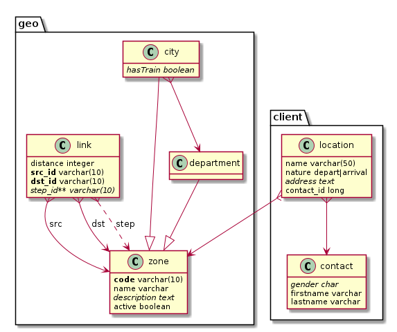

# kddl

Kotlin SQL DDL format and associated formatters towards PostgresQL and PlantUML.

## Usage

Here's the `example.kddl` file, which should be enough to understand the syntax by example.

```
// Definition for database geo

// Supported data types:
//   boolean, integer, serial, long, float, double, numeric(*n*,p), money,
//   time, date, datetz, datetime, datetimetz, char, char(*n), varchar(*n*), text,
//   enum( 'value1' [,] 'value2' ...)

// a database contains options and schemas
database geo {

  // options
  option id_suffix = '_key' // default is '_id'

  // a schema contains tables and links
  schema infra {

    // a table contains fields, either given a type or a destination table
    table zone {
      *code varchar(10)      // '*' stands for 'part of pk', otherwise pk is generated as needed
      !name varchar(50)       // '!' stands for unique
      description text?      // '?' stands for nullable field
      active boolean = false // default value
    }

    table department : zone // inherit a table from another (for engines which support table inheritance like PostgresQL)

    table city : zone { hasTrain boolean? }  // declarations can be inlined

    table link {
      distance integer
      src_id -> zone    // mandatory foreign key field
      dst_id ---> zone  // arrows can be as long as you want
      hub_id ..> zone (down)   // nullable foreign key field
    }

    city *--> department (up) // plantuml arrow direction can be specified
  }

  schema client {

    table contact {
      // gender, lastname, firstname // field types are optional for plantuml (use a coma to disambiguate)
      gender char?                   // field types are mandatory for postgresql
      firstname varchar(200)
      lastname varchar(200)
    }

    table location {
      name varchar(50) = 'untitled'    // string literals use single quotes
      nature enum('depart', 'arrival') // enum types
      address text?
    }

    location *--> contact
    location *..> infra.zone // foreign key referencing a table in another schema

  }

}
```

To generate the plantuml graph definition script for this model, do:

```shell
kddl -i example.kddl -f plantuml > example.pu
plantuml -Tpng example.pu
eog example.png
```

And here's the result:



You may need to install plantuml, with something like `sudo apt install plantuml`.

To generate the PostgreSQL creation script for this model, do:

```shell
kddl -i example.kddl -f postgresql > example.sql
```

## Installation (linux)

### Linux

You first need to clone this repository and launch the `install.sh` script, which will install the kddl library in your local maven repository, along with its dependencies, among which a [forked version of the net.akerhurst.language:agl-processor](https://github.com/arkanovicz/net.akehurst.language).

```shell
git clone git@gitlab.renegat.net:claude/kddl.git
./install.sh
```

To install the `kddl` command everywhere, do:

```shell
ln -s ~/<path_to_kddl_repository>/kddl.sh ~/bin/kddl
```

### Other platforms

Please adapt the installation and run scripts.

## Building

```
$ ./gradlew generateKotlinCommonGrammarSource
$ ./gradlew build
```


## TODO

- finish handling of multivalued fks
- reverse enginering via modality
- plugins for gradle / maven / kobalt
- foreign key links could be written reverse
- db versionning handling (generation of update scripts from previous version)
- make `database {}` surrounding optional
- allow reverse arrows
- only schema and table names are quoted for now
- prefix '+' for multivalued fks (change number of '+' for several fks)
- custom types
- more tests (for instance: inheritance from another schema's table)
- add consistence checks on fk fields types correspondances
- align fields (add a space if no field prefix)
- kddl files inclusions
- add implicit identifiers at start
- replace ".>" syntax by "-?>" syntax (nullable foreign key), or by "-> Foo?" syntax
- find a syntax for cascading
- support enum(foo,bar) (without quotes) or juste foo|bar
- use postgreSQL VARCHAR() (without specified length) for string data type


And also overcome the limitations listed below...

## limitations

+ a field can be implied in one foreign key at most (but maybe it as a good practice per se)
+ multivalued foreign keys fields must be named after target primary key fields (quite the same...)
